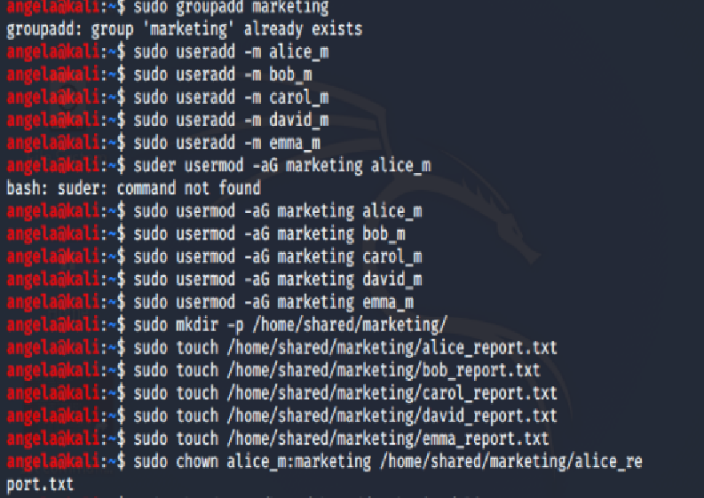
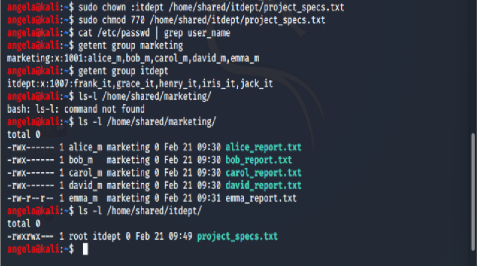

# Linux User Management Lab Assignment

## Objective
To set up user accounts and file permissions in a Linux environment, specifically within Kali Linux, simulating a working scenario for a technology company.

## Tools Used
- Kali Linux

## Step-by-Step Process
1. **Created a group called `marketing`.**
2. **Created user accounts:**
   - `alice_m`
   - `bob_m`
   - `carol_m`
   - `david_m`
   - `emma_m`
3. **Added users to the `marketing` group.**
4. **Created personal files in `/home/shared/marketing/` for each user.**
5. **Set user permissions to 700 for individual files.**
6. **Created a group called `itdept`.**
7. **Created user accounts:**
   - `frank_it`
   - `grace_it`
   - `henry_it`
   - `iris_it`
   - `jack_it`
8. **Added users to the `itdept` group.**
9. **Created a shared file in `/home/shared/itdept/`.**
10. **Set permissions for the shared file to 770.**

## Commands Executed
- `sudo groupadd marketing`
- `sudo useradd -m alice_m`
- (Add all other commands used for execution here)

## Screenshots of Results

## Key Observations / Lessons Learned
- Gained hands-on experience with Linux user management.
- Understood the importance of file permissions.

## Conclusion
This lab greatly enhanced my understanding of system administration in Linux, particularly user and group management.
